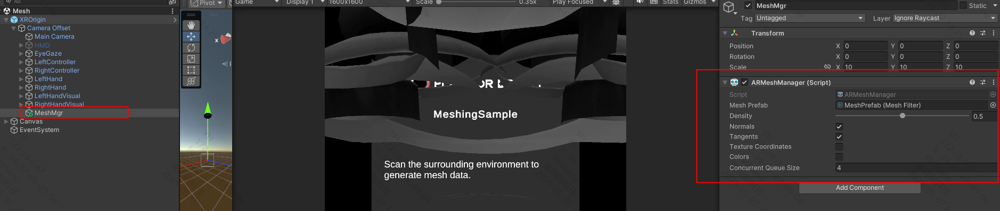

# Mesh

使用 AR Foundation 中提供的 `AR Mesh Manager` 组件将场景中的内容转化成网格，该功能根据扫描的真实世界几何形状生成网格。

## 要求

- 需要 Play For Dream MR 设备， OS 3.1.0 以上版本
- 使用网格功能前，需前往 `Edit > Project Settings` > `XR Plug-in Management` > `YVR` > `Feature Request` ,然后勾选 `Require Scene Anchor` 来开启权限

    

## 使用说明
1. 将 `AR Mesh Manager` 组件添加到场景内 XROrigin 对象的子节点中。

    
2. `AR Mesh Manager` 组件中 `MeshPrefab` 字段为每个扫描网格实例化的预制体， `MeshPrefab` 预制体上需要包含 `Mesh Filter` 组件，如需显示扫描网格效果，需要添加 `MeshRender`组件，并添加对应 `Material` 材质效果

    

`AR Mesh Manager` 脚本详细文档通过 [AR Foundation 网格管理](https://docs.unity3d.com/Packages/com.unity.xr.arfoundation@6.2/manual/features/meshing.html) 查看