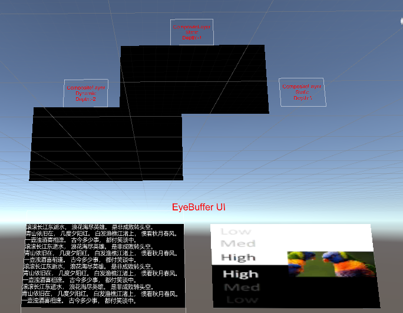

# 合成层

合成层（Composition Layers）可以将所有需要展示的物体进行分割，以达到诸如提高特定对象清晰度的目的。在最传统的渲染模式下，场景内所有的物体都将被渲染至同一张纹理（Eye Buffer）中，该纹理将由系统进行 ATW、畸变、合成等处理并最终显示在设备屏幕上。我们可以通过合成层技术，将场景内的特定对象渲染至一张纹理上，并将该纹理直接交由系统进行合成，因此减少了一次额外的纹理采样，提高了物体渲染的清晰度。

需要注意的是，合成层并非万能的，每一个合成层对于系统而言都会增加合成的开销，因此在使用合成层时，需要根据实际需求和设备性能进行合理的使用：
- 建议将合成层用于需要提高清晰度的物体上，例如 UI 界面、文字等。
- 合成层的数量不宜过多，一般情况下，单个场景的合成层数量控制在 4 层左右即可。
- 合成层的深度值需要合理设置，以确保合成层和 Eye Buffer 中的内容不会引发错误的遮挡效果。

## 合成层类型

将合成层根据类型划分可分为 Overlay 和 Underlay 两种类型：
- Overlay：Overlay 类型的合成层将纹理呈现在 Eye Buffer 前面，默认为该选项。对于需要始终出现在 Eye Buffer 前面的物体，如光标，可以使用 Overlay 类型的合成层。
- Underlay：Underlay 类型的合成层将纹理呈现在 Eye Buffer 后面。由于 Underlay 层依赖于渲染目标上的 alpha 通道。场景中的所有对象绘制到 Eye Buffer 后，你需要在 Eye Buffer 上构建一个 “洞”，使 Underlay 纹理透过这个 “洞” 显示出来。类似 UI 界面这样的物体，可能会被 Eye Buffer 内的其他物体所遮挡（如 UI 被手柄遮挡），此时可以使用 Underlay 类型的合成层。

可通过 `compostion depth` 来区分 Overlay 和 Underlay 类型的合成层：
- Eye Buffer 的深度值为 0。
- Underlay 类型的合成层深度值小于 0。
- Overlay 类型的合成层深度值大于 0。
 
## 合成层形状 

合成层的形状决定了合成层的展示效果。合成层的形状有三种：Quad、Cylinder 和 Equirect：

- **Quad**：具有四个顶点的四边形平面纹理，通常用来显示场景中的文本或信息。
- **Cylinder**：具有柱面弧度的圆柱形纹理，通常用于显示曲面 UI 界面。若使用 Cylinder，则：
  - Transform 中心将作为 Cylinder 的中心，Transform 的尺寸将作为 Cylinder 的尺寸，且 Cylinder 中 Transform 的尺寸均为全局尺寸（Global Scale）。其中，Z 作为 Cylinder 的半径，Y 作为 Cylinder 的高，X/Z 作为 Cylinder 的弧长。
  - 必须将摄像机放置在圆柱内切球内。如果摄像机接近内切球表面，合成层将无法显示。
- **Equirect**：球体纹理，通常用于显示 360/180 全景纹理。
  - Radius 参数用于指定圆柱的半径，当设置为 0 或者正无限大（1.0f/0.0f）时，表示无限大的半径。球面半径无限大时，其展示效果如同空场景中的天空盒。
  - Destination Rects 下的 X 参数无用；W 参数映射到中心角，关于中心点坐标 (0, 0) 对称。

## 纹理类型

合成层处理的对象为纹理，纹理类型可分为三种：
- 外部纹理：纹理内容是从 Unity 的渲染上下文外获取。在通常的使用案例下，为 Android Surface 直接获取纹理（例如：Android 播放器视频纹理），对于视频播放器等场景，需要使用外部纹理。
- 动态纹理：纹理内容在运行时会发生更新，例如：摄像机生成的 RenderTexture 图片。
- 静态纹理：纹理内容在运行时不会发生更新，如场景中的静态广告图片。

## 纹理

针对使用在合成层上的纹理，可以有以下的设置：

### Texture Rects

勾选 Texture Rects 选框后，可配置 Source Rects 和 Destination Rects 相关参数。

若选择自定义 Source Rects 和 Destination Rects（即选择 Custom 选项），则需确保 X、Y、W、H 的值位于指定区间内：X：$[0,1)$、Y：$[0,1)$、W：$(0,1]$、H：$(0,1]$。

### 透明度

`alpha` 参数用于设置纹理的透明度，取值范围为 $[0,1]$。

## 示例

CompositeLayer 场景是用来说明合成层效果的。合成层的设计是为了提高平面 UI 的清晰度。在传统的渲染管道中，UI 纹理必须首先被渲染到 Unity 管理的颜色缓冲区，然后 Unity 管理的颜色缓冲区将被渲染到屏幕缓冲区。而使用合成层时，目标 UI 纹理可以直接由本地渲染。因此，可以减少由采样引起的失真。

在 YVR 设备上运行 CompositeLayer 场景时的屏幕截图如下：
     
    

> [!CAUTION]
> 由于合成层是由 YVR 设备的原生系统渲染的，所以内容不能在 Unity 编辑器中显示。

下面的部分是由 Unity Eye Buffer 渲染的界面，上面的部分是用合成层渲染的。左边的部分是动态纹理，右边的部分是静态纹理。

使用合成层（上部）和 Unity Eye Buffer（下部）渲染的详细区别如下：
     
    

> [!CAUTION]
> 在细节图像中可以看到一些色散，这是为抵消镜头造成的色散而产生的。因此，在使用设备时，不会看到所有的色散.

### 合成层示例

请参考以下示例项目。

1. 打开一个新项目或当前项目。

2. 导入最新版 SDK。

3. 在 Project 面板下，选择 **Pacakages** > **YVR Core** > **Scenes** > **CompositeLayer**。

4. 在 CompositeLayer 文件夹中，选择 **CompositeLayer.unity** 打开该场景。

5. 在 **File** > **Build Settings...** 下，选择 **Add Open Scenes**。

6. 选择 **Build** 并为文件命名。 

7. 在设备上安装 APK 文件。

8. 该场景显示不同深度值遮挡效果、动态和静态图像的效果。
     
    

### 图形雨矩形示例

请参考以下示例项目。

1. 打开一个新项目或当前项目。

2. 导入最新版 SDK。

3. 在 Project 面板下，选择 **Pacakages** > **YVR Core** > **Scenes** > **CompositeLayer**。

4. 在 CompositeLayer 文件夹中，选择 **CompositeLayerShapeAndRect.unity** 打开该场景。

5. 在 **File** > **Build Settings...** 下，选择 **Add Open Scenes**。

6. 选择 **Build** 并为文件命名。 

7. 在设备上安装 APK 文件。

8. 该场景显示形状切换、设置源矩形和目标矩形的效果。
     
    

## Underlay vs Overlay

由于原生系统需要对多个图层进行合成，因此需要知道所有图层的顺序。这个顺序是由合成层的深度决定的，Unity Eye Buffer 的深度被设置为 0。而所有深度大于 0 的层被称为 Overlay，而深度小于 0 的层被称为 Underlay。

底层将首先被绘制，然后是 Unity Eye Buffer，最后是 Overlay。因此，Unity Eye Buffer 将覆盖 Underlay，而 Overlay 将覆盖 Eye Buffer。

为了让 Underlay 正常显示，而不是被完全覆盖，需要在 Unity Eye Buffer 中开一个孔。着色器 `YVR/UnderlayPuncher` 被设计用来生成这样的孔： 
     
    

> [!TIP]
> 示例场景中左上角的图层是 Underlay。