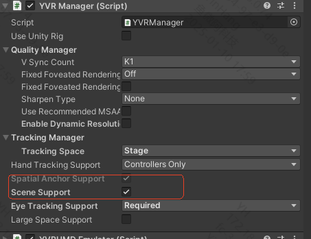

# 空间网格

## 概述
空间网格用于表示和理解物理环境的三维结构。它通常由一系列的多边形（通常是三角形）组成，这些多边形共同构成了一个三维网格，用于描述现实世界中的物体和表面。在 Unity 中将通过访问 `XRMeshSubsystem` 来获取和更新网格信息，并在场景中动态生成和更新网格对象。

## 如何启用空间网格

YVR 实现了 UnityXR **XRMeshSubsystem** 对应接口，具体可参考 [Unity XRMeshSubsystem 文档](https://docs.unity.cn/cn/current/ScriptReference/XR.XRMeshSubsystem.html)


- 开启 scene 对应功能。
  - 勾选 scene Support 功能

    

  - 申请 scene 对应权限
    ```
    public void ScenePermissionRequest()
    {
        const string spatialPermission = "com.yvr.permission.USE_SCENE";
        if (!UnityEngine.Android.Permission.HasUserAuthorizedPermission(spatialPermission))
        {
            var callbacks = new UnityEngine.Android.PermissionCallbacks();
            callbacks.PermissionDenied += Denied;
            callbacks.PermissionGranted += Granted;
            UnityEngine.Android.Permission.RequestUserPermission(spatialPermission, callbacks);
        }
    }
    private void Denied(string permission) => Debug.Log($"{permission} Denied");
    private void Granted(string permission) => Debug.Log($"{permission} Granted");
    ```
- 开启网格检测
    ```
    YVRMeshTracking.instance.CreateMeshDetector();
    ```

- 启用透视模式。
    ```
    YVRPlugin.Instance.SetPassthrough(true);
    ```
- 获取可用的 `XRMeshSubsystem` 实例。
  ```
    var meshSubsystems = new List<XRMeshSubsystem>();
    SubsystemManager.GetInstances(meshSubsystems);
  ```

### 获取空间网格更新信息()
- 获取当前网格信息
  ```
    private static XRMeshSubsystem s_MeshSubsystem;
    private static List<MeshInfo> s_MeshInfos = new List<MeshInfo>();
    private Dictionary<MeshId, MeshFilter> m_MeshIdToGo = new Dictionary<MeshId, MeshFilter>();
    private void UpdateMeshInfos()
    {
        if (s_MeshSubsystem == null)
        {
            Debug.LogError("s_MeshSubsystem is null");
            return;
        }
        if (s_MeshSubsystem.TryGetMeshInfos(s_MeshInfos))
        {
            foreach (var meshInfo in s_MeshInfos)
            {
                switch (meshInfo.ChangeState)
                {
                    case MeshChangeState.Added:
                    case MeshChangeState.Updated:
                        AddToQueueIfNecessary(meshInfo);
                        break;
                    case MeshChangeState.Removed:
                        if (m_MeshIdToGo.TryGetValue(meshInfo.MeshId, out var meshGo))
                        {
                            Destroy(meshGo);
                            m_MeshIdToGo.Remove(meshInfo.MeshId);
                        }
                        break;
                    default:
                        break;
                }
            }
        }
    }
  ```

### 更新网格块的位置和旋转

- 更新网格对象位置和旋转。
    ```
    private void UpdateMeshTransform()
    {
        NativeArray<MeshTransform> meshTransforms = s_MeshSubsystem.GetUpdatedMeshTransforms(Allocator.Temp);
        foreach (var item in meshTransforms)
        {
            if (m_MeshIdToGo.TryGetValue(item.MeshId, out MeshFilter meshFilter))
            {
                if (meshFilter.transform.position != item.Position)
                {
                    meshFilter.transform.position = item.Position;
                    meshFilter.transform.rotation = item.Rotation;
                }
            }
        }
    }
    ```

### 更新对应网格块数据

- 如果网格对象不存在，实例化一个新的网格对象并添加到字典中。
- 存在则异步生成网格并更新其位置和旋转。
    ```
    public GameObject emptyMeshPrefab;
    public Transform target;
     private void AddToQueueIfNecessary(MeshInfo meshInfo)
    {
        if (!m_MeshIdToGo.TryGetValue(meshInfo.MeshId, out var meshFilter))
        {
            meshFilter = Instantiate(emptyMeshPrefab, target, false).AddComponent<MeshFilter>();
            m_MeshIdToGo[meshInfo.MeshId] = meshFilter;
        }

        var mesh = meshFilter.mesh;
        s_MeshSubsystem.GenerateMeshAsync(meshInfo.MeshId, mesh, null, MeshVertexAttributes.None, (result) =>
        {
            if (result.Status == MeshGenerationStatus.Success)
            {
                if (meshFilter.transform.position != result.Position)
                {
                    meshFilter.transform.position = result.Position;
                    meshFilter.transform.rotation = result.Rotation;
                }
            }
        }, MeshGenerationOptions.ConsumeTransform);
    }
    ```

### 如何停止网格检测

```
    YVRMeshTracking.instance.DestroyMeshDetector();
```
