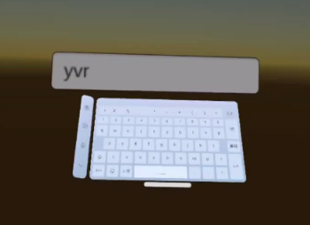

# 系统键盘

系统键盘功能让开发者可以在应用能直接使用 Dream OS 中能提供的系统键盘进行文字的输入，而不需要自己开发键盘。其原理是系统将监听应用需要唤醒键盘的事件，并在这种情况下通过 [焦点感知](FocusAwareness.md) 功能唤醒键盘。

## 使用示例

> [!tip]
> 下示例核心是创建一个 Unity 的 InputField，并在场景中使用系统键盘进行输入。

1. 在 **Hierarchy** 面板下，完成以下步骤：
    
    - 选择 **+** > **UI** > **Event System** 将事件系统添加至场景中
    - 选择 **+** > **UI** > **Canvas** 将画布添加至场景中

2. 选中 **Canvas** 并在 **Inspector** 面板下，完成以下步骤：

    - 将 **Render Mode** 设置为 **World Space**
    - 将 **Event Camera** 将为 **Main Camera**
    - 将 **Tracked Device Graphics Raycast** 脚本添加至 **Canvas**

3. 在 **Hierachy** 面板下，右击 **Canvas** 并选择 **UI** > **Input Field - TextMeshPro** 从快捷菜单中将输入字段加到场景中。

4. 打包应用至真机，并在真机上点击 Input Field，此时将看到系统键盘弹出。

> [!note]
> 系统键盘功能在 Editor 下无法使用
