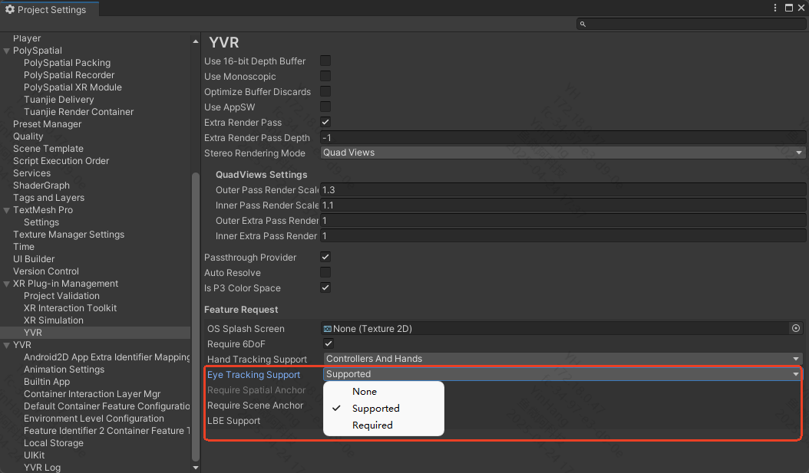

# 眼动追踪

> [!note]
>
> 需要 Play For Dream MR 设备， OS 3.1.0 以上版本

## 配置流程
1. 确保设备设置中开启了眼动追踪功能
2. 打开 `ProjectSettings` 选择 `XR Plug-in Management` 下 `YVR` 面板在 `Eye Tracking Support` 中选择是否支持眼动追踪。
    


我们基于 `XR Devices` 提供了眼动数据，你可以通过 [GetDevicesWithCharacteristics](https://docs.unity3d.com/2022.3/Documentation/ScriptReference/XR.InputDevices.GetDevicesWithCharacteristics.html) 和 [InputDeviceCharacteristics.EyeTracking](https://docs.unity3d.com/6000.0/Documentation/ScriptReference/XR.InputDeviceCharacteristics.EyeTracking.html) 找寻到眼动设备，并从中获取眼动的数据：

```csharp
InputDevice eyeDevice = default;
var devices = new List<InputDevice>();
InputDevices.GetDevicesWithCharacteristics(InputDeviceCharacteristics.EyeTracking, devices);
if (devices.Count > 0) eyeDevice = devices[0];

eyeDevice.TryGetFeatureValue(CommonUsages.devicePosition, out Vector3 position);
eyeDevice.TryGetFeatureValue(CommonUsages.deviceRotation, out Quaternion rotation);
```

> [!tip]
>
> 关于眼动的更多信息，可参考 [Eye Tracking Sample](https://github.com/PlayForDreamDevelopers/EyeTrackingSample-Unity)
