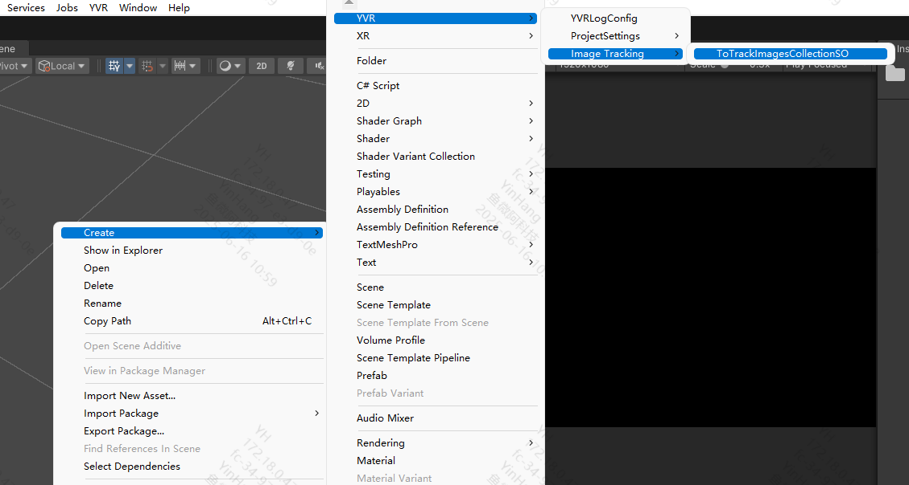

# 图像跟踪

## 概述

图像跟踪是指设备识别平面（如海报、扑克牌或数字显示器）上特定图像的能力。您可以使用图像跟踪在用户环境中查找图像并向其添加虚拟内容。例如，您可以在应用中使用图像跟踪功能来检测特定图像，并为用户提供显示产品 3D 可视化效果的屏幕体验。

## 要求

  - 需要 Play For Dream MR 设备
  - OS 3.1.0 以上版本

## 配置参考图库

### 创建图像跟踪库

在 `Assets\XR\Resources\`目录下，创建 `ToTrackImagesCollectionSO` 资源



这将在您的项目中创建一个图像跟踪库，您可以将需要识别跟踪的图像添加到此库中。

### 将图像添加到图像跟踪库

要将图像添加到参考图像库，您必须先将图像作为资源添加到项目中。为此，请转到 `Assets > Import New Asset` 并从文件资源管理器中选择相关图像。

将图像添加到 `Assets` 文件夹后，请按照以下步骤将其添加到参考图像库:

1. 在 `Inspector` 窗口中打开 `ToTrackImagesCollectionSO.asset` 资源文件。
2. 选择 **Add new image** 按钮添加新的跟踪图像。
3. 配置对应识别图像信息

### 配置跟踪图像设置

将图像添加到库后，您可以在 `Inspector` 窗口中配置以下设置：

| 属性 | 描述 |
|--|--|
| Image Id | 运行时可用的字符串名称，可用于识别检测到的参考图像 |
| Image| 从参考图像文件创建的 Texture2D 资源。|
| Size| 追踪图像在物理环境中显示的大小（以米为单位） |
| Image File Path | 参考图像的路径 |

## 图像追踪管理

### 启用或禁用图像追踪功能。

1. 在应用程序中启用图像追踪，请先执行 [配置参考图库](#配置参考图库)。
2. 要跟踪环境中的图像，必须将图像添加到 [配置参考图库](#配置参考图库), 图像追踪仅检测此库中的图像。

```
//开启或关闭图像跟踪功能.
ImageTrackingMgr.instance.SwitchImageTracking(true);
```
**参数**:

| 名称    | 类型   | 描述              |
|---------|--------|-------------------|
| enable  | bool   | true: 启用追踪<br>false: 禁用追踪 |

### 注册所有配置的图像模板。

```
ImageTrackingMgr.instance.RegisterTrackImageLibrary();
```

### 注册全局图像追踪更新回调（所有追踪图像共用）。

```
ImageTrackingMgr.instance.RegisterImageTrackingUpdateCallback(OnImageTrackingUpdate);
private void OnImageTrackingUpdate(TrackedImageInfo info){}
```
**参数**:

| 名称       | 类型                         | 描述           |
|------------|------------------------------|----------------|
| callback   | Action<TrackedImageInfo>     | 追踪更新回调   |

### 注销全局图像追踪更新回调。

```
ImageTrackingMgr.instance.UnRegisterImageTrackingUpdateCallback(OnImageTrackingUpdate);
```
**参数**:

| 名称       | 类型                         | 描述           |
|------------|------------------------------|----------------|
| callback   | Action<TrackedImageInfo>     | 要移除的回调   |

### 注册特定图像ID的追踪更新回调。

```
ImageTrackingMgr.instance.RegisterImageTrackingUpdateCallback("targetImage"，OnImageTrackingUpdate);
private void OnImageTrackingUpdate(TrackedImageInfo info){}
```

**参数**:

| 名称       | 类型                         | 描述                     |
|------------|------------------------------|--------------------------|
| imageId    | string                       | 目标图像的ID             |
| callback   | Action<TrackedImageInfo>     | 该图像的追踪更新回调 |

### 注销特定图像ID的追踪更新回调。

```
ImageTrackingMgr.instance.UnRegisterImageTrackingUpdateCallback("targetImage",OnImageTrackingUpdate);
```
**参数**:

| 名称       | 类型                         | 描述                   |
|------------|------------------------------|------------------------|
| imageId    | string                       | 目标图像的ID           |
| callback   | Action<TrackedImageInfo>     | 要移除的回调       |

### 注销指定图像模板

```
\\ToTrackImagesCollectionSO 资源库中的 Image Id.
ImageTrackingMgr.instance.UnRegisterImageTemplate("targetImage");
```
**参数**:

| 名称       | 类型             | 描述               |
|------------|------------------|--------------------|
| imageId    | string           | 要注销的图像ID     |


## 使用示例

```csharp
// 开启 VST
YVRManager.instance.hmdManager.SetPassthrough(true);

// 注册所有配置的图像模板。
ImageTrackingMgr.instance.RegisterTrackImageLibrary();

// 注册全局回调
ImageTrackingMgr.instance.RegisterImageTrackingUpdateCallback(OnImageTracked);

// 注册特定图像回调
ImageTrackingMgr.instance.RegisterImageTrackingUpdateCallback("targetImage", OnTargetTracked);

// 启用追踪
ImageTrackingMgr.instance.SwitchImageTracking(true);

void OnImageTracked(TrackedImageInfo info)
{
    Debug.Log($"追踪到图像: {info.imageId}");
}

void OnTargetTracked(TrackedImageInfo info)
{
    Debug.Log($"特定图像位置: {info.pose.position}");
}
```
