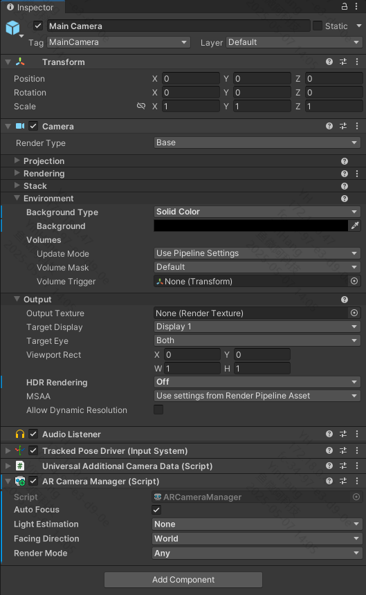

# Camera

Explains how to enable video passthrough functionality in PFDM using AR Foundation components.

## Passthrough Setup

1. After adding a `XROrigin` object to the scene, attach the `AR Camera Manager` component to the Camera GameObject.
2. Select the `Camera` component and set `Background Type` under `Environment` to **Clear Flags**.
3. Set `Background` to **RGBA (0000) / Hexadecimal 000000**.
4. Set `HDR Rendering` to **Off**.

    