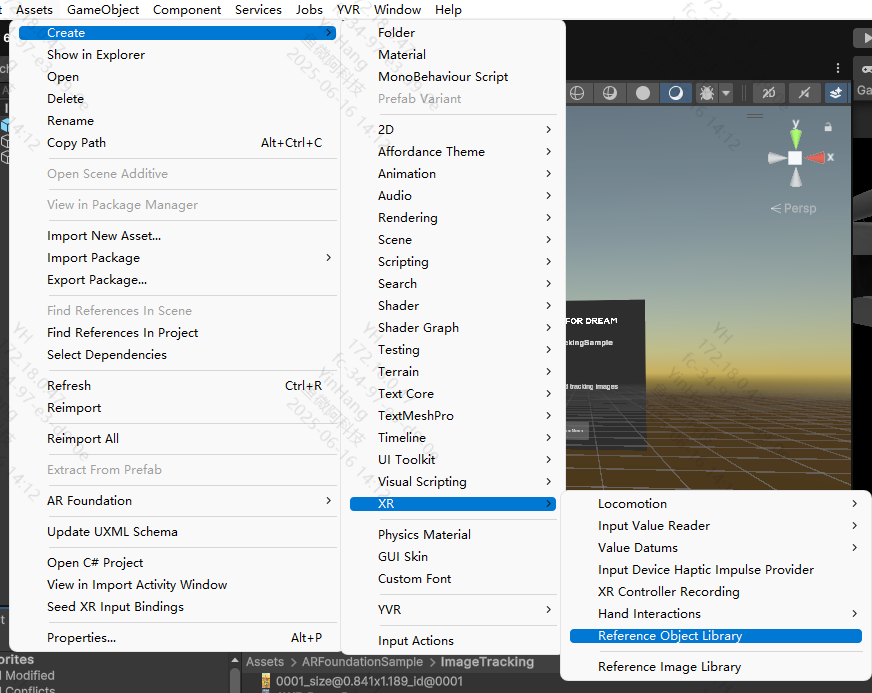
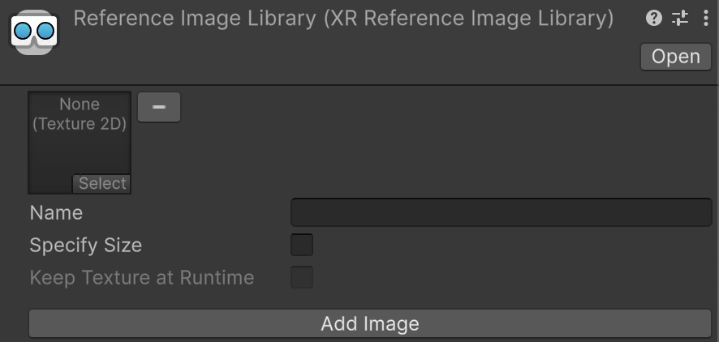

## Image Tracking

Image tracking functionality is implemented in projects using AR Foundation.

## Requirements
- Requires Play For Dream MR device
- OS version 3.1.0 or higher

## Usage Instructions

Below are basic instructions for using image tracking. For detailed documentation, refer to Unity's official [AR Foundation Image Tracking](https://docs.unity3d.com/Packages/com.unity.xr.arfoundation@6.2/manual/features/image-tracking.html) documentation.

### Configuring Image Library

#### Creating Reference Image Library


#### Adding Images to Reference Image Library
1. Open the Reference Image Library asset in the Inspector window
2. Click the Add Image button to add images to the library
3. In the image preview box, click "Select" to open the image browser
4. Choose relevant images from the dropdown list (repeat for each image)



### Image Tracking Management Component

#### Enabling Image Tracking
To enable image tracking:
1. Add the `AR Tracked Image Manager` component to your `XR Origin` GameObject
2. If your scene doesn't contain an `XR Origin` GameObject, follow Unity's scene setup instructions first

**Performance Note:** Disable the `AR Tracked Image Manager` component when image tracking isn't needed to improve application performance. On unsupported devices, the component will automatically disable itself during **OnEnable**.

#### Setting Reference Image Library
To detect images in the environment:
1. Select the `AR Tracked Image Manager` component in the Inspector window
2. Click the Serialized Library selector (⊙)
3. Choose your reference image library from the `Assets` folder

#### Image Tracking Prefab
When an image from the reference library is detected, this prefab will be instantiated. The manager ensures instantiated GameObjects contain an `ARTrackedImage` component. Access reference image data through `ARTrackedImage.referenceImage`.

#### Responding to Detected Images
Subscribe to the `AR Tracked Image Manager`'s `trackablesChanged` event to receive notifications when images are added, updated, or removed:

```csharp
[SerializeField]
ARTrackedImageManager m_ImageManager;

void OnEnable() => m_ImageManager.trackablesChanged.AddListener(OnChanged);

void OnDisable() => m_ImageManager.trackablesChanged.RemoveListener(OnChanged);

void OnChanged(ARTrackablesChangedEventArgs<ARTrackedImage> eventArgs)
{
    foreach (var newImage in eventArgs.added)
    {
        // Handle added event
    }

    foreach (var updatedImage in eventArgs.updated)
    {
        // Handle updated event
    }

    foreach (var removed in eventArgs.removed)
    {
        // Handle removed event
        TrackableId removedImageTrackableId = removed.Key;
        ARTrackedImage removedImage = removed.Value;
    }
}
```

### Image Tracking Component
The `ARTrackedImage` component is a trackable object containing data associated with detected 2D images. When the device detects a 2D image from the reference library in the environment, the `AR Tracked Image Manager` creates an `ARTrackedImage`.

Key properties include:
- `name`: Identifier of recognized image
- `trackingState`: Current tracking status
- `size`: Physical dimensions of detected image
- `pose`: Position and rotation in world space