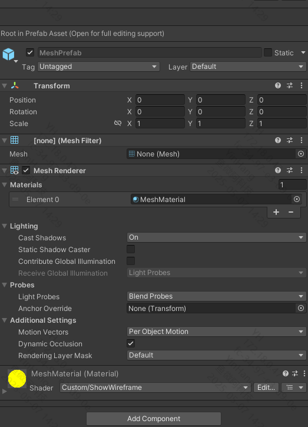

# Mesh

The `AR Mesh Manager` component provided by AR Foundation converts scene content into meshes, generating geometry based on scanned real-world environments.

## Requirements

- Requires Play For Dream MR devices with OS 3.1.0 or later
- Before using meshing features, enable permissions by navigating to:  
  `Edit > Project Settings` > `XR Plug-in Management` > `YVR` > `Feature Request`  
  then check **Require Scene Anchor**

    

## Usage Guide

1. Add the `AR Mesh Manager` component to a child GameObject under the XROrigin in your scene.

    

2. The `MeshPrefab` field in the `AR Mesh Manager` component specifies the prefab to instantiate for each scanned mesh. This prefab must:
   - Contain a `Mesh Filter` component
   - Include a `MeshRender` component (for visualization)
   - Have appropriate `Material` configurations

    

For full documentation of the `AR Mesh Manager` component, see Unity's [AR Foundation Meshing Documentation](https://docs.unity3d.com/Packages/com.unity.xr.arfoundation@6.2/manual/features/meshing.html).