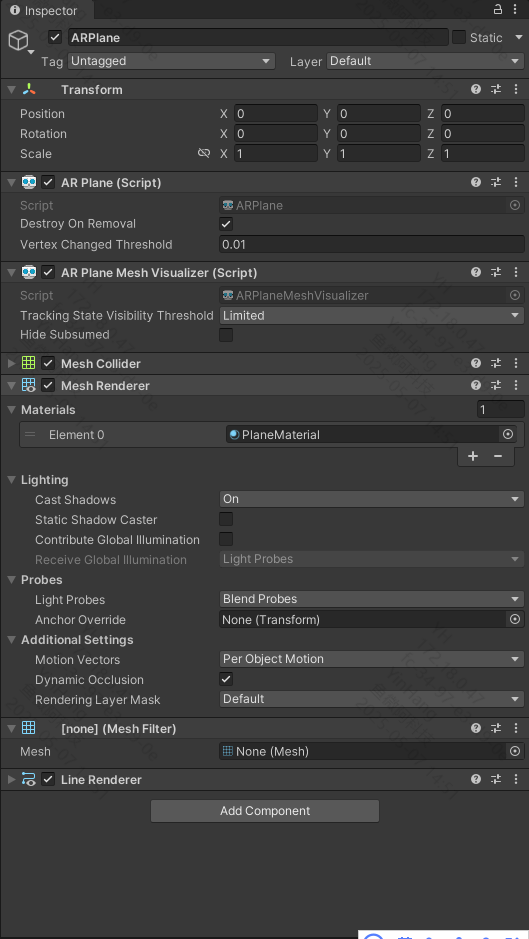

# Plane Detection

Plane detection refers to detecting and tracking flat surfaces in the physical environment. Using components in AR Foundation, you can control plane detection functionality in your application and create ARPlane trackers for each detected surface.

## Requirements

- Requires Play For Dream MR devices with OS 3.1.0 or later
- Plane detection depends on Scene permissions. Navigate to:
  `Edit > Project Settings` > `XR Plug-in Management` > `YVR` > `Feature Request`
  then check **Require Scene Anchor** to enable permissions

    

## Usage Guide

1. Add the `AR Plane Manager` component to the XROrigin object in your scene. The `ARPlaneManager` component is a plane tracking manager that detects and tracks flat surfaces in the physical environment, creating GameObjects for each detected plane.

    

2. Assign a `Plane Prefab` to the `AR Plane Manager`. When a tracked plane is detected, the manager will instantiate the `Plane Prefab` GameObject. This prefab contains plane-related data and continuously updates the plane.

3. The `Plane Prefab` must include both `AR Plane` and `AR Plane Mesh Visualizer` components for plane tracking and updates. Based on the functionality of the `AR Plane Mesh Visualizer` script, add `Mesh Filter`/`Mesh Renderer`/`Line Renderer` components to visualize the plane.

    

For detailed documentation of the plane detection component, see Unity's [AR Foundation Plane Detection Documentation](https://docs.unity3d.com/Packages/com.unity.xr.arfoundation@6.2/manual/features/plane-detection.html).