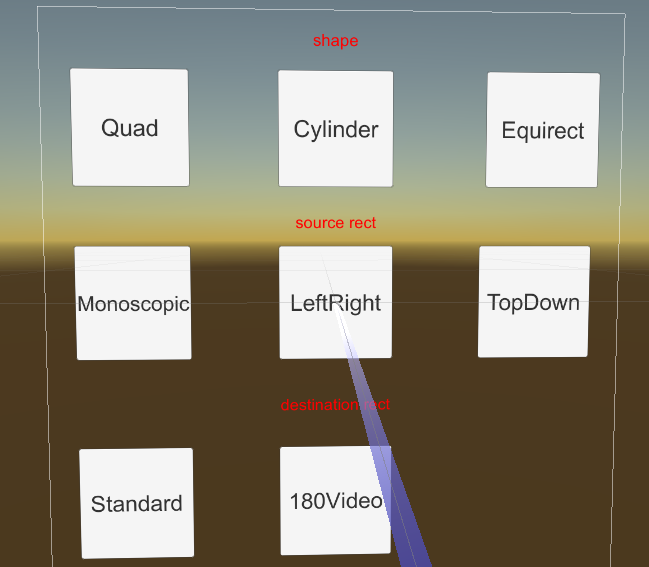

# Composition Layers

Composition Layers can segment all objects that need to be displayed to achieve purposes such as improving the clarity of specific objects. In the most traditional rendering mode, all objects in the scene will be rendered to the same texture (Eye Buffer), which will be processed by the system for ATW, distortion, composition, and finally displayed on the device screen. By using composition layer technology, specific objects in the scene can be rendered to a texture and handed over to the system for composition, thus reducing an extra texture sampling and improving the clarity of object rendering.

It should be noted that composition layers are not omnipotent. Each composition layer will increase the composition overhead for the system. Therefore, when using composition layers, it is necessary to use them reasonably according to actual needs and device performance:
- It is recommended to use composition layers for objects that need to improve clarity, such as UI interfaces, text, etc.
- The number of composition layers should not be too many. Generally, the number of composition layers in a single scene should be controlled to about 4 layers.
- The depth value of the composition layer needs to be set reasonably to ensure that the content in the composition layer and the Eye Buffer will not cause incorrect occlusion effects.

## Types of Composition Layers

Composition layers can be divided into two types based on their type: Overlay and Underlay:
- **Overlay**: The texture of the Overlay type composition layer is presented in front of the Eye Buffer by default. For objects that need to always appear in front of the Eye Buffer, such as cursors, the Overlay type composition layer can be used.
- **Underlay**: The texture of the Underlay type composition layer is presented behind the Eye Buffer. Since the Underlay layer relies on the alpha channel on the rendering target, after all objects in the scene are drawn to the Eye Buffer, you need to create a "hole" on the Eye Buffer to allow the Underlay texture to show through this "hole". For objects like UI interfaces that may be occluded by other objects in the Eye Buffer (such as UI being occluded by a controller), the Underlay type composition layer can be used.

The `composition depth` can be used to distinguish between Overlay and Underlay types of composition layers:
- The depth value of the Eye Buffer is 0.
- The depth value of the Underlay type composition layer is less than 0.
- The depth value of the Overlay type composition layer is greater than 0.

## Shapes of Composition Layers

The shape of the composition layer determines the display effect of the composition layer. There are three shapes of composition layers: Quad, Cylinder, and Equirect:

- **Quad**: A quadrilateral plane texture with four vertices, usually used to display text or information in the scene.
- **Cylinder**: A cylindrical texture with a cylindrical arc, usually used to display curved UI interfaces. If using Cylinder:
    - The center of the Transform will be the center of the Cylinder, the size of the Transform will be the size of the Cylinder, and the size of the Transform in the Cylinder will be the global size (Global Scale). Among them, Z is the radius of the Cylinder, Y is the height of the Cylinder, and X/Z is the arc length of the Cylinder.
    - The camera must be placed inside the inscribed sphere of the cylinder. If the camera approaches the surface of the inscribed sphere, the composition layer will not be displayed.
- **Equirect**: A spherical texture, usually used to display 360/180 panoramic textures.
    - The Radius parameter is used to specify the radius of the cylinder. When set to 0 or positive infinity (1.0f/0.0f), it indicates an infinitely large radius. When the spherical radius is infinitely large, its display effect is like a skybox in an empty scene.
    - The X parameter under Destination Rects is useless; the W parameter maps to the central angle, symmetrical about the central point coordinates (0, 0).

## Texture Types

The objects processed by the composition layer are textures, which can be divided into three types:
- **External Texture**: The texture content is obtained from outside the Unity rendering context. In typical use cases, it is directly obtained from the Android Surface texture (e.g., Android player video texture). For scenarios such as video players, external textures need to be used.
- **Dynamic Texture**: The texture content will be updated at runtime, such as the RenderTexture image generated by the camera.
- **Static Texture**: The texture content will not be updated at runtime, such as static advertisement images in the scene.

## Textures

For textures used in composition layers, the following settings can be made:

### Texture Rects

After checking the Texture Rects checkbox, you can configure the parameters related to Source Rects and Destination Rects.

If you choose to customize Source Rects and Destination Rects (i.e., select the Custom option), you need to ensure that the values of X, Y, W, and H are within the specified range: X: $[0,1)$, Y: $[0,1)$, W: $(0,1]$, H: $(0,1]$.

### Transparency

The `alpha` parameter is used to set the transparency of the texture, with a value range of $[0,1]$.

## Examples

The CompositeLayer scene is used to illustrate the effect of composition layers. The design of the composition layer is to improve the clarity of the flat UI. In the traditional rendering pipeline, the UI texture must first be rendered to the color buffer managed by Unity, and then the color buffer managed by Unity will be rendered to the screen buffer. When using composition layers, the target UI texture can be rendered directly by the local renderer. Therefore, distortion caused by sampling can be reduced.

The following is a screenshot of running the CompositeLayer scene on a YVR device:
 

> [!CAUTION]
> Since the composition layer is rendered by the native system of the YVR device, the content cannot be displayed in the Unity editor.

The lower part is the interface rendered by the Unity Eye Buffer, and the upper part is rendered by the composition layer. The left part is a dynamic texture, and the right part is a static texture.

The detailed differences between rendering with composition layers (upper part) and Unity Eye Buffer (lower part) are as follows:
 

> [!CAUTION]
> Some dispersion can be seen in the detailed image, which is generated to offset the dispersion caused by the lens. Therefore, when using the device, not all dispersion will be seen.

### Composition Layer Example

Please refer to the following example project.

1. Open a new project or the current project.

2. Import the latest SDK.

3. In the Project panel, select **Packages** > **YVR Core** > **Scenes** > **CompositeLayer**.

4. In the CompositeLayer folder, select **CompositeLayer.unity** to open the scene.

5. In **File** > **Build Settings...**, select **Add Open Scenes**.

6. Select **Build** and name the file.

7. Install the APK file on the device.

8. This scene shows the effects of different depth values, dynamic and static images.
 

### Shape and Rect Example

Please refer to the following example project.

1. Open a new project or the current project.

2. Import the latest SDK.

3. In the Project panel, select **Packages** > **YVR Core** > **Scenes** > **CompositeLayer**.

4. In the CompositeLayer folder, select **CompositeLayerShapeAndRect.unity** to open the scene.

5. In **File** > **Build Settings...**, select **Add Open Scenes**.

6. Select **Build** and name the file.

7. Install the APK file on the device.

8. This scene shows the effects of shape switching, setting source rectangles, and destination rectangles.
 

## Underlay vs Overlay

Since the native system needs to composite multiple layers, it needs to know the order of all layers. This order is determined by the depth of the composition layer. The depth of the Unity Eye Buffer is set to 0. All layers with a depth greater than 0 are called Overlay, and layers with a depth less than 0 are called Underlay.

The bottom layer will be drawn first, followed by the Unity Eye Buffer, and finally the Overlay. Therefore, the Unity Eye Buffer will cover the Underlay, and the Overlay will cover the Eye Buffer.

To make the Underlay display normally and not be completely covered, a hole needs to be created in the Unity Eye Buffer. The shader `YVR/UnderlayPuncher` is designed to generate such a hole:
 

> [!TIP]
> The layer in the upper left corner of the example scene is Underlay.