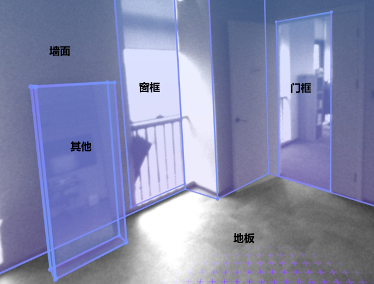

# Room Calibration

Room calibration is a system-level application provided by YVR to ensure the precise alignment of virtual objects with the physical environment. Through room calibration, the realism and stability of the virtual reality program can be improved to provide users with a more interactive and immersive experience. Users can calibrate the walls, doors, windows, tables, chairs, sofas and other objects in the real room through the room calibration application. Developers can obtain user-created calibration data via the SDK and use it in their own apps.


## Requirement

- SDK Version: Unity SDK 2.8.0 and above
- Device Model: YVR 2
- System Version: DreamOS 1.3.0 and above

## Calibration Data Permissions

The room information and calibration data created by the room calibration app can be obtained through the SDK APIs and used in your own app, or you can create your own anchors within the app.

> [!Note]
> - Data modification permission: third-party apps cannot create rooms, only room calibration apps are allowed to modify data
> <br />
> - Data read permission: room calibration apps and third-party apps can read room calibration data

Ensure that the Spatial Anchor Support and Scene Support checkboxes are checked in the YVRManager script.

> [!Note]
> After checking the Spatial Anchor Support and Scene Support boxes, the anchor permissions are added to the AndroidManifest.xml file.
> <br />
> **\<uses-permission android:name="com.yvr.permission.USE_ANCHOR_API"\\>**
> <br />
> **\<uses-permission android:name="com.yvr.permission.USE_SCENE"\\>**

com.yvr.permission.USE_SCENE is a runtime permission that allows the application to query spatial data on the user's device only when the user grants the permission. [Requesting Android runtime permissions](https://docs.unity3d.com/Manual/android-RequestingPermissions.html) makes a permission request.


## Types of Components that can be included in Scene Anchors

Scene Anchor requires components in order to describe a calibrated environment. Therefore, the app needs to obtain the spatial information contained in the anchor point by querying Scene Anchor if the given component is supported and if it is enabled or not.
- Locatable: A locatable component that informs the system that this locator can be tracked, and when enabled, the app can continuously query the positional information of the locator.
- Storable: Storable component, when enabled, it means the anchor point can be saved.
- RoomLayout: Room layout component that contains references to the wall, ceiling and floor anchors that make up the room.
- AnchorContainer: It contains references to a list of anchor points for other objects in the room (sofa, coffee table, windows, etc.).
- Bounded2D: Location point information for 2D planar data, containing the width and height of the plane and the offset relative to the x,y axis of the anchor point (or indexed triangle mesh for non-rectangular planes).
- Bounded3D: 3D cube data, containing the width, height and offset of the cube with respect to the x,y,z, axes of the anchor point.
- SemanticLabels: Semantic labels for the anchors, this component can categorize the anchors into multiple categories, read the following for details.


## Common Scene Anchor Points

Scene anchor points for the room will have:
1. RoomLayout component is used to reference the ceiling, walls and floor.
2. AnchorContainer component is used to hold all the scene anchors in the room.
<br />
Scene anchors for 2D elements (e.g. walls, ceilings, floors, windows, etc.): a Locatable component for the user to get the location of the anchor; a SemanticLabels semantic labelling component; and Boundary2D planar dimension data.
<br />
Scene anchors for 3D elements (e.g. sofa, coffee table, table, etc.): a locatable component for the user to get the location of the anchor; a SemanticLabels semantic labeling component; and Bounded3D cube information. <br /> 




## Semantic Classification of Anchors

Semantic classification categorizes scene anchors into a predefined and systematically managed list of object types. Semantics segregate objects into their corresponding geometric descriptions in order to provide application developers with classification-specific game logic. Supported Semantic Tags:

| **Semantic Type** | **Description** |   | 
| ----------------- | --------------- | - | 
| FLOOR | Floor | 2D | 
| CEILING | Ceiling | 2D | 
| WALL_FACE | Wall face | 2D | 
| COUCH | Couch | 3D | 
| DOOR_FRAME | Door frame | 2D | 
| WINDOW_FRAME | Window frame | 2D | 
| OTHER | Others | 3D | 
| TABLE | Table | 3D | 
| BED | Bed | 3D | 

> [!Note]
> This list tab is evolving as we regularly add support for more 2D and 3D objects.


## Anchor Point Axes

The orientation of the axes of the 2D elements and 3D elements created by the room calibration app is related to their type and the order in which they were created, according to the following rules:

### Wall, Door and Window

The origin is at the centre of the wall
- +X: counterclockwise from above according to the left hand coordinate system
- +Y: perpendicular to the floor upwards
- +Z: inwards perpendicular to the wall

### Floor

The origin is at the geometric centre of the floor
- +X: clockwise along the wall pointing in the direction of the first plotted point, as seen from above
- +Y: according to the left hand coordinate system
- +Z: vertically facing up

### Ceiling

The origin is at the geometric centre of the ceiling
- +X: -X direction of the floor
- +Y: according to the left hand coordinate system
- +Z: vertically facing down

### Sofa, Bed, Table and Others


<br />

The first line AB draws the height, then the two prongs BC and CD of the top face. The origin is at the centre of the top face
- +X: CB direction
- +Y: according to the left hand coordinate system
- +Z: AB direction


## Get Room Calibration Data
### Get room layout information for anchor points

YVRSceneAnchor.instance.GetAnchorRoomLayout gets information about the room layout of the anchor point.
```Csharp
/// <summary>
/// Gets the room layout information for the specified space anchor point.
/// </summary>
/// <param name="anchorHandle">Handle of the spatial anchor</param>
/// <param name="roomLayout">Return room layout information</param>
/// <returns>true if the room layout information was successfully obtained; otherwise false</returns>
public bool GetAnchorRoomLayout(ulong anchorHandle, out YVRRoomLayout roomLayout)
``` 

YVRRoomLayout contains UUIDs for room floor, ceiling, and wall anchors.
```Csharp
public struct YVRRoomLayout  
{  
    // Floor anchors
    public YVRSpatialAnchorUUID floorUuid;  
    // Ceiling anchors
    public YVRSpatialAnchorUUID ceilingUuid;  
    // List of wall anchors
    public YVRSpatialAnchorUUID[] wallUuids;  
}
```

### Get container information for an anchor point

YVRSceneAnchor.instance.GetAnchorContainer gets information about the anchor's container.
```Csharp
/// <summary>
/// Gets container information for the specified spatial anchor point.
/// </summary>
/// <param name="anchorHandle">Handle of the spatial anchor</param>
/// <param name="containerUuids">List of container UUIDs returned</param>
/// <returns>true if the container information was successfully retrieved; otherwise false</returns>
public bool GetAnchorContainer(ulong anchorHandle, out List<YVRSpatialAnchorUUID> containerUuids)
```

### Get the Rectangular Plane of the Anchor Point

YVRSceneAnchor.instance.GetAnchorBoundingBox2D provides access to anchor rectangular plane information.
```Csharp
/// <summary>
/// Gets 2D bounding box information for the specified spatial anchor point.
/// </summary>
/// <param name="anchorHandle">Handle of the spatial anchor</param>
/// <param name="boundingBox2D">Return 2D bounding box information</param>
/// <returns>true if the bounding box information was successfully retrieved; otherwise false</returns>
public bool GetAnchorBoundingBox2D(ulong anchorHandle, out YVRRect2D boundingBox2D)
```

YVRRect2D contains the width and height of the plane as well as the offset on the x,y axes relative to the origin of the anchor position.
```Csharp
public struct YVRRect2D  
{  
    // Offset of the plane with respect to the anchor point on the x,y axes
    public Vector2 offset;  
    // Width and height of the plane
    public Vector2 extent;  
}
```

### Get the 3D Bounding Box of the Anchor Point

YVRSceneAnchor.instance.GetAnchorBoundingBox3D provides access to the 3D information of an anchor.
```Csharp
/// <summary>/// Gets the 3D bounding box information for the specified spatial anchor point./// </summary>
/// <param name="anchorHandle">Handle of the spatial anchor</param>
/// <param name="boundingBox3D">Returned 3D bounding box information</param>
/// <returns>true if the bounding box information was successfully retrieved; otherwise false</returns>
public bool GetAnchorBoundingBox3D(ulong anchorHandle, out YVRRect3D boundingBox3D)
```

YVRRect3D contains the length, width and height of the 3D object as well as the x,y,z axis offsets with respect to the origin of the anchor position.
```Csharp
public struct YVRRect3D {    
    // Offset of the 3D object in x,y,z axes with respect to the origin of the anchor point.    
    public Vector3 offset;    // Length, wdith and height of the 3D object     
    public Vector3 extent;}
```

### Get Information about the Irregular Plane Vertices of an Anchor Point

YVRSceneAnchor.instance.GetAnchorBoundary2D returns information about the non-rectangular plane of the anchor point.
```Csharp
/// <summary>/// Get the plane vertex information of the anchor point/// </summary>
/// <param name="anchorHandle">Handle of the spatial anchor</param>
/// <param name="boundary">Returns the set of vertices of the plane</param>
/// <returns>true if the boundary information was successfully obtained; otherwise false</returns>
public bool GetAnchorBoundary2D(ulong anchorHandle, out List<Vector2> boundary)
```

### Get Semantic Labels for Anchors

YVRSceneAnchor.instance.GetAnchorSemanticLabels returns the semantic labels of the anchor points.
```Csharp
/// <summary>/// Gets information about the semantic labelling of an anchor point./// </summary>
/// <param name="anchorHandle">Handle of the spatial anchor</param>
/// <param name="labels">The semantic label string returned</param>
/// <returns>true if the semantic tag information was successfully retrieved; otherwise false</returns>
public bool GetAnchorSemanticLabels(ulong anchorHandle, out string labels)
```

> [!Note]
> When the component type supported by the anchor is of type **Bounded2D**, you can use the **GetAnchorBoundingBox2D** API to get the rectangular plane data as well as the **GetAnchorBoundary2D** API to get the plane's vertex data. (If the room calibration plane is non-rectangular, then GetAnchorBoundingBox2D will return the smallest outer rectangle based on the vertices of the plane.)


### Launch Room Calibration App

Call YVRSceneAnchor.instance.RequestSceneCapture to enable room calibration references for room calibration.


## Obtain Room Calibration Data Process

You can retrieve the contents of the room calibration data through the following steps: 

1. Query the anchor with the component RoomLayout through the YVRSpatialAnchor.instance.QuerySpatialAnchor API.
2. For the queried RoomLayout component anchor, get all the child anchors under the room calibration through YVRSceneAnchor.instance.GetAnchorContainer API.
3. Loop through all child anchors using the YVRSpatialAnchor.instance.QuerySpatialAnchor API via the UUID.
4. For a queried sub-anchor, call YVRSpatialAnchor.instance.GetSpatialAnchorComponentStatus to retrieve if it supports the corresponding component type
5. If you want to know the dimensions, call GetAnchorBoundingBox2D, GetAnchorBoundary2D or GetAnchorBoundingBox3D to return the corresponding information and scale the Unity object accordingly.


## Code Example

```Csharp
private YVRSpatialAnchorResult m_RoomLayoutAnchor;
private List<YVRSpatialAnchorResult> m_ContainerAnchors = new List<YVRSpatialAnchorResult>();
// Get the anchor point of the RoomLayout component.
public void GetRoomLayoutAnchor()
{
    YVRSpatialAnchorQueryInfo queryInfo = new YVRSpatialAnchorQueryInfo();  
    queryInfo.storageLocation = YVRSpatialAnchorStorageLocation.Local;  
    queryInfo.component = YVRSpatialAnchorComponentType.RoomLayout;  
    YVRSpatialAnchor.instance.QuerySpatialAnchor(queryInfo, OnQueryRoomLayoutAnchorCallback);
}
private void OnQueryRoomLayoutAnchorCallback(List<YVRSpatialAnchorResult> spatialAnchorResults)  
{  
    if(spatialAnchorResults != null && spatialAnchorResults.Count >= 0)
    {
        m_RoomLayoutAnchor = spatialAnchorResults.First();
    }
    else
    {
        // No calibration information, jump to room calibration app for calibration
        YVRSceneAnchor.instance.RequestSceneCapture("");
    }
}
// Get all anchors under the room calibration
public void GetAnchorAontainer()
{
    if(m_RoomLayoutAnchor.anchorHandle == 0) return;
    bool result = YVRSceneAnchor.instance.GetAnchorContainer(m_RoomLayoutAnchor.anchorHandle,  out List<YVRSpatialAnchorUUID> container);  
    if (!result) return;  
      
    YVRSpatialAnchorQueryInfo queryInfo = new YVRSpatialAnchorQueryInfo();  
    queryInfo.storageLocation = YVRSpatialAnchorStorageLocation.Local;  
    queryInfo.ids = container.ToArray();  
    YVRSpatialAnchor.instance.QuerySpatialAnchor(queryInfo, OnQueryContainerCallback);
}
private void OnQueryContainerCallback(List<YVRSpatialAnchorResult> spatialAnchorResults)
{
    m_ContainerAnchors = spatialAnchorResults;
}
// Get information about the vertices of the irregular plane
private void GetAnchorBoundary2DData(YVRSpatialAnchorResult anchor)
{
    YVRSpatialAnchor.instance.GetSpatialAnchorComponentStatus(anchor.anchorHandle, YVRSpatialAnchorComponentType.Bounded2D, out YVRSpatialAnchorComponentStatus status);
    if(status.enable)
    {
        YVRSceneAnchor.instance.GetAnchorBoundary2D(anchor.anchorHandle, out List<Vector2> boundary);  
    if (boundary!=null)  
    {  
        for (int i = 0; i < boundary.Count; i++)  
        {  
            Debug.Log($"boundary uuid:{new string(anchor.uuid)} index:{i} x:{boundary[i].x},y:{boundary[i].y}");  
        }  
    }
    }
}
// Get information about the plane of the anchor rectangle  
private void GetAnchorBoundingBox2DDate(YVRSpatialAnchorResult anchor) 
{  
    YVRSpatialAnchor.instance.GetSpatialAnchorComponentStatus(anchor.anchorHandle, YVRSpatialAnchorComponentType.Bounded2D, out YVRSpatialAnchorComponentStatus status);  
    if (status.enable)  
    {  
        YVRSceneAnchor.instance.GetAnchorBoundingBox2D(anchor.anchorHandle, out YVRRect2D boundingBox2D);  
        Debug.Log(  
            $"box2d uuid:{new string(anchor.uuid)} boundingBox2D offset.x:{boundingBox2D.offset.x},offset.y:{boundingBox2D.offset.y},extent.x:{boundingBox2D.extent.x},extent.y:{boundingBox2D.extent.y}");  
    }  
}
// Get anchor 3D information
private void GetAnchorBoundingBox3DDate(YVRSpatialAnchorResult anchor) 
{  
    YVRSpatialAnchor.instance.GetSpatialAnchorComponentStatus(anchor.anchorHandle, YVRSpatialAnchorComponentType.Bounded3D, out YVRSpatialAnchorComponentStatus status);  
    if (status.enable)  
    {  
        YVRSceneAnchor.instance.GetAnchorBoundingBox3D(anchor.anchorHandle, out YVRRect3D boundingBox3D);  
        Debug.Log(  
            $"box3d uuid:{new string(anchor.uuid)} boundingBox3D offset.x:{boundingBox3D.offset.x},offset.y:{boundingBox3D.offset.y},offset.z:{boundingBox3D.offset.z},extent.x:{boundingBox3D.extent.x},extent.y:{boundingBox3D.extent.y},extent.z:{boundingBox3D.extent.z}");  
    }  
}
// Get information about the semantic labels of the anchors  
private void GetAnchorSemanticLabelsDate(YVRSpatialAnchorResult anchor)  
{  
    YVRSpatialAnchor.instance.GetSpatialAnchorComponentStatus(anchor.anchorHandle, YVRSpatialAnchorComponentType.SemanticLabels, out YVRSpatialAnchorComponentStatus status);  
    if (status.enable)  
    {  
        YVRSceneAnchor.instance.GetAnchorSemanticLabels(anchor.anchorHandle, out string semanticLabels);  
        Debug.Log($"semanticLabel anchor uuid:{new string(anchor.uuid)} semanticLabels:{semanticLabels}");  
    }  
}
private void GetAnchoComponentData()  
{  
    foreach (var anchor in m_ContainerAnchors)  
    {  
        GetAnchorBoundary2DData(anchor);  
        GetAnchorBoundingBox2DDate(anchor);  
        GetAnchorBoundingBox3DDate(anchor);  
        GetAnchorSemanticLabelsDate(anchor);  
    }  
}
```


## Sample Project

For more information, refer to [Scene Anchor Sample](https://github.com/YVRDeveloper/SceneAnchorSample).