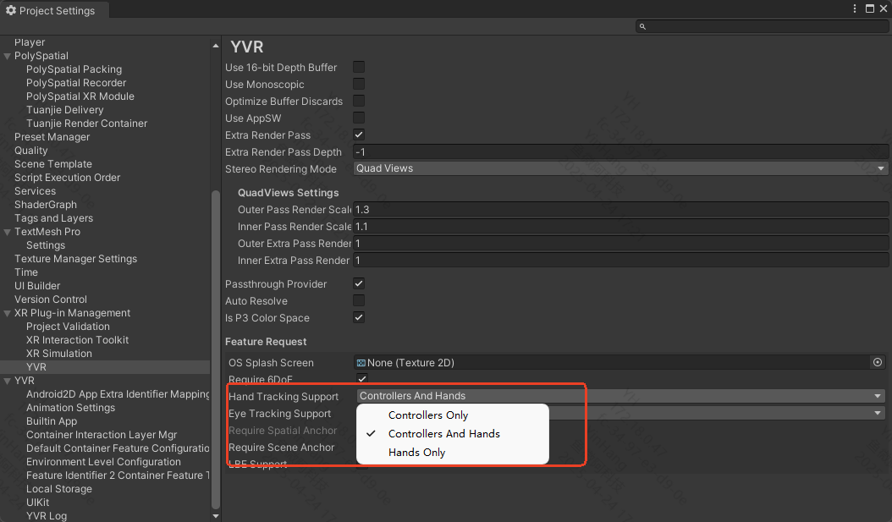

# Hand Tracking

## Configure Development Environment

### Device

- YVR2
- Play For Dream MR

### Device System Version

- 1.2.2.209 and above

### Unity Version

- LTS version

> [!Note] 
> Compatible with Real-time Preview Tool version 3.1 and above.

## Configuration Process

1. Enable the **Hand Tracking** feature in the system lab of the device.
2. Import the YVR package.
3. Create a new scene or open an existing scene in the Unity editor.
4. Drag `YVRCameraRig` from the `com.yvr.core/Prefabs/` directory to the `Hierarchy` panel.
5. Select `YVRCameraRig`, and in the `YVRManager` component, choose whether to support hand tracking or controller from `Hand Tracking Support` to enable hand tracking or controller capabilities for the application.
    
6. Build the scene and run it on the device.
> [!Note] 
> Refer to the code comments for specific interfaces.

## Obtain Hand Tracking Data

You can obtain hand tracking-related information by calling the interfaces provided by the SDK, including feature enable status, tracking accuracy, gesture data, and hand interaction status.

### Feature Enable Status

| **Interface** | **Feature Enable Status** |
| :------------ | :------------------------ | 
| YVRHandManager.GetHandTrackingEnable | Get the enable status of the hand tracking feature. The request will return a boolean value, `true` means "enabled", `false` means "not enabled". |

### Tracking Accuracy & Gesture Data

| **Interface** | **Gesture Data** |
| :------------ | :--------------- | 
| YVRHandManager.leftHandData / YVRHandManager.rightHandData | Get gesture data, including the number of joints, hand size, joint direction and position, and hand interaction status, including ray interaction posture, and whether each finger is pinching and the specific pinch strength. |

### Hand Interaction Status

| **Interface** | **Hand Interaction Status** |
| :------------ | :-------------------------- | 
| YVRHandManger.GetFingerPinchStrength | Get the pinch strength between other fingers and the thumb. |
| YVRHandManager.GetPinch | Get whether the fingers are pinching. |
| YVRHandManager.GetPinchDown | Get whether the fingers triggered a pinch in the current frame. |
| YVRHandManager.GetPinchUp | Get whether the fingers triggered a pinch release in the current frame. |

### Switching Between Controller Input and Hand Gesture Input

After enabling the hand tracking capability on the device,
- The condition for the controller to switch to hand gesture input is: the controller is not connected or the connected controller is idle for 5 seconds, enabling hand tracking.
- The condition for hand gesture input to switch to the controller is: the controller is powered on or a button on the connected idle controller is pressed.

**Device Input Switching Process**
1. Listen to the YVRManager.instance.eventsManager.onInputDeviceChange event.
2. Call YVRPlugin.Instance.GetCurrentInputDevice(ref ActiveInputDevice inputDevice) to query the current input device.
3. Set the current input device for UI interaction input, YVRInputModule.Instance.SetInputDataProvider(DataProviderSource source).
4. Show and hide the corresponding device objects.

> [!Note]
> The interaction toolkit recommends using [Samples | XR Interaction Toolkit | 2.3.1](https://docs.unity3d.com/Packages/com.unity.xr.interaction.toolkit@2.3/manual/samples.html#hands-interaction-demo)
